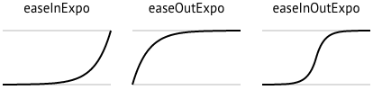
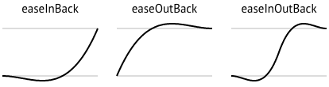
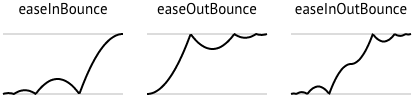

It`s possible to animate any object. This page explains how to make the animation work in many ways and ease functions. Animations in Supernova are made by Actions. These Actions can be used in all Scene objects.

There are these types of actions:

* TimeAction
    * MoveAction
    * RotateAction
    * ScaleAction
    * ColorAction
    * AlphaAction
* ParticlesAnimation
* SpriteAnimation

### Action control

Any kind of **action** can be controlled with these tree main methods:

| Method | Description |
| ----- | ----------- |
| ```run()``` | Start an Action ou resume if is paused. |
| ```stop()``` | Stop and reset it timestamp. |
| ```pause()``` | Pause an Action, could be resumed with run(). |

### Action events

Also, you can use actions with these callback events:

| Event | Description |
| ----- | ----------- |
| ```onStart(Object*)``` | Called when Action is started (timestamp = 0). |
| ```onRun(Object*)``` | When method run() is called. |
| ```onPause(Object*)``` | When method pause() is called. |
| ```onStop(Object*)``` | When method stop() is called. |
| ```onFinish(Object*)``` | Called after finished Action. if loop is true this will never be called. |
| ```onStep(Object*)``` | Called at each iteration. Usually sync with onDraw engine event. |

## TimeAction

TimeAction is a generic type of action that has the values ```time``` and ```value```. Both values can range from 0 to 1. The ```time``` is always fixed by a pre-defined duration, but ```value``` is calculated by an ease function. ```Value``` can be controlled by both pre-defined functions and user-defined functions.

Getting value and time from Action:

``` c++
float time = action.getTime();
float value = action.getValue();
```     
``` lua
time = action:getTime()
value = action:getValue()
```
Class default constructor:  
**TimeAction(time_in_seconds, loop)**

Example how to use **TimeAction** that is activating on touch press and on every step triangle is moved:

``` c++
#include "Supernova.h"

#include "Scene.h"
#include "Polygon.h"
#include "Camera.h"
#include "TimeAction.h"
#include "MoveAction.h"

using namespace Supernova;

Polygon triangle;
Scene scene;
TimeAction* action;

void onActionOnStep(Object* object);
void onTouchPress(float x, float y);

void init(){
    Engine::setCanvasSize(1000, 480);

    triangle.addVertex(Vector3(0, -100, 0));
    triangle.addVertex(Vector3(-50, 50, 0));
    triangle.addVertex(Vector3(50, 50, 0));

    triangle.setPosition(Vector3(300, 300, 0));
    triangle.setColor(0.6, 0.2, 0.6, 1);

    scene.addObject(&triangle);

    action = new TimeAction(2, true);

    action->setFunctionType(S_LINEAR);
    triangle.addAction(action);

    action->onStep(onActionOnStep);

    Engine::setScene(&scene);
    Events::onTouchPress(onTouchPress);
}

void onActionOnStep(Object* object){
    object->setPosition(200 + action->getValue() * 100, 200);
}

void onTouchPress(float x, float y){
    if (action->isRunning())
        action->pause();
    else
        action->run();
}
```
``` lua
Engine.setCanvasSize(1000,480)

scene = Scene()
triangle = Polygon()

triangle:addVertex(0, -100, 0)
triangle:addVertex(-50, 50, 0)
triangle:addVertex(50, 50, 0)

triangle:setPosition(300,300,0)
triangle:setColor(0.6, 0.2, 0.6, 1)

scene:addObject(triangle)

action = TimeAction(2, false)

action:setFunctionType(TimeAction.LINEAR)
triangle:addAction(action)

Engine.setScene(scene)

function onActionOnStep(object)
    object:setPosition2D(200 + action:getValue() * 100, 200);
end
action:onStep(onActionOnStep);

function onTouchPress(x, y)
    if (action:isRunning()) then
        action:pause()
    else
        action:run()
    end
end
Events:onTouchPress(onTouchPress);
```

Similar to the previous example, the same function can be used with **MoveAction** instead of **TimeAction**. This time it is no longer necessary to use ```onStep()```:

``` c++
#include "Supernova.h"

#include "Scene.h"
#include "Polygon.h"
#include "Camera.h"
#include "MoveAction.h"

using namespace Supernova;

Polygon triangle;
Scene scene;
MoveAction* action;

void onTouchPress(float x, float y);

void init(){
    Engine::setCanvasSize(1000, 480);

    triangle.addVertex(Vector3(0, -100, 0));
    triangle.addVertex(Vector3(-50, 50, 0));
    triangle.addVertex(Vector3(50, 50, 0));

    triangle.setPosition(Vector3(300, 300, 0));
    triangle.setColor(0.6, 0.2, 0.6, 1);

    scene.addObject(&triangle);

    action = new MoveAction(triangle.getPosition(), Vector3(0,10,0), 2, true);

    action->setFunctionType(S_LINEAR);
    triangle.addAction(action);
    action->run();

    Engine::setScene(&scene);
    Events::onTouchPress(onTouchPress);
}

void onTouchPress(float x, float y){
    if (action->isRunning())
        action->pause();
    else
        action->run();
}
```
``` lua
Engine.setCanvasSize(1000,480)

scene = Scene()
triangle = Polygon()

triangle:addVertex(0, -100, 0)
triangle:addVertex(-50, 50, 0)
triangle:addVertex(50, 50, 0)

triangle:setPosition(300,300,0)
triangle:setColor(0.6, 0.2, 0.6, 1)

scene:addObject(triangle)

action = MoveAction(triangle.position, Vector3(500,700,0), 2, true)

action:setFunctionType(Action.EASE_ELASTIC_IN_OUT)
triangle:addAction(action)
action:run()

Engine.setScene(scene)

function onTouchPress(x, y)
    if (action:isRunning()) then
        action:pause()
    else
        action:run()
    end
end
Events:onTouchPress(onTouchPress);
```

### Pre-defined ease functions

#### Linear

``` c++
action.setFunctionType(S_LINEAR);
```
``` lua
action:setFunctionType(TimeAction.LINEAR);
```
#### Quad

``` c++
action.setFunctionType(S_EASE_QUAD_IN);
action.setFunctionType(S_EASE_QUAD_OUT);
action.setFunctionType(S_EASE_QUAD_IN_OUT);
```
``` lua
action:setFunctionType(Action.EASE_QUAD_IN);
action:setFunctionType(Action.EASE_QUAD_OUT);
action:setFunctionType(Action.EASE_QUAD_IN_OUT);
```
#### Cubic

``` c++
action.setFunctionType(S_EASE_CUBIC_IN);
action.setFunctionType(S_EASE_CUBIC_OUT);
action.setFunctionType(S_EASE_CUBIC_IN_OUT);
```
``` lua
action:setFunctionType(Action.EASE_CUBIC_IN);
action:setFunctionType(Action.EASE_CUBIC_OUT);
action:setFunctionType(Action.EASE_CUBIC_IN_OUT);
```
#### Quart

``` c++
action.setFunctionType(S_EASE_QUART_IN);
action.setFunctionType(S_EASE_QUART_OUT);
action.setFunctionType(S_EASE_QUART_IN_OUT);
```
``` lua
action:setFunctionType(Action.EASE_QUART_IN);
action:setFunctionType(Action.EASE_QUART_OUT);
action:setFunctionType(Action.EASE_QUART_IN_OUT);
```
#### Quint

``` c++
action.setFunctionType(S_EASE_QUINT_IN);
action.setFunctionType(S_EASE_QUINT_OUT);
action.setFunctionType(S_EASE_QUINT_IN_OUT);
```
``` lua
action:setFunctionType(Action.EASE_QUINT_IN);
action:setFunctionType(Action.EASE_QUINT_OUT);
action:setFunctionType(Action.EASE_QUINT_IN_OUT);
```
#### Sine

``` c++
action.setFunctionType(S_EASE_SINE_IN);
action.setFunctionType(S_EASE_SINE_OUT);
action.setFunctionType(S_EASE_SINE_IN_OUT);
```
``` lua
action:setFunctionType(Action.EASE_SINE_IN);
action:setFunctionType(Action.EASE_SINE_OUT);
action:setFunctionType(Action.EASE_SINE_IN_OUT);
```
#### Expo

``` c++
action.setFunctionType(S_EASE_EXPO_IN);
action.setFunctionType(S_EASE_EXPO_OUT);
action.setFunctionType(S_EASE_EXPO_IN_OUT);
```
``` lua
action:setFunctionType(Action.EASE_EXPO_IN);
action:setFunctionType(Action.EASE_EXPO_OUT);
action:setFunctionType(Action.EASE_EXPO_IN_OUT);
```
#### Circ

``` c++
action.setFunctionType(S_EASE_CIRC_IN);
action.setFunctionType(S_EASE_CIRC_OUT);
action.setFunctionType(S_EASE_CIRC_IN_OUT);
```
``` lua
action:setFunctionType(Action.EASE_CIRC_IN);
action:setFunctionType(Action.EASE_CIRC_OUT);
action:setFunctionType(Action.EASE_CIRC_IN_OUT);
```
#### Elastic

``` c++
action.setFunctionType(S_EASE_ELASTIC_IN);
action.setFunctionType(S_EASE_ELASTIC_OUT);
action.setFunctionType(S_EASE_ELASTIC_IN_OUT);
```
``` lua
action:setFunctionType(Action.EASE_ELASTIC_IN);
action:setFunctionType(Action.EASE_ELASTIC_OUT);
action:setFunctionType(Action.EASE_ELASTIC_IN_OUT);
```
#### Back

``` c++
action.setFunctionType(S_EASE_BACK_IN);
action.setFunctionType(S_EASE_BACK_OUT);
action.setFunctionType(S_EASE_BACK_IN_OUT);
```
``` lua
action:setFunctionType(Action.EASE_BACK_IN);
action:setFunctionType(Action.EASE_BACK_OUT);
action:setFunctionType(Action.EASE_BACK_IN_OUT);
```
#### Bounce

``` c++
action.setFunctionType(S_EASE_BOUNCE_IN);
action.setFunctionType(S_EASE_BOUNCE_OUT);
action.setFunctionType(S_EASE_BOUNCE_IN_OUT);
```
``` lua
action:setFunctionType(Action.EASE_BOUNCE_IN);
action:setFunctionType(Action.EASE_BOUNCE_OUT);
action:setFunctionType(Action.EASE_BOUNCE_IN_OUT);
```

### User-defined ease functions

It's also possible to create new functions and attach it to a TimeAction.

``` c++
float newFunction(float time){
    return time * 2;
}

action.setFunction(newFunction);
```
``` lua
function newFunction(time)
    return time * 2
end

action:setFunction(newFunction);
```


## MoveAction

Is used to generate a movement in objects.

Class default constructor:  
**MoveAction(start_position, end_position, time_in_seconds, loop)**

``` c++
action = new MoveAction(Vector3(100,200,0), Vector3(0,10,0), 2, false);
```
``` lua
action = MoveAction(Vector3(100,200,0), Vector3(0,10,0), 2, true)
```

## RotateAction

Is used to generate rotation in objects. Rotations are made by quaternions, but you can easily a create quaternions with angles.

Class default constructor:  
**RotateAction(start_rotation, end_rotation, time_in_seconds, loop)**

``` c++
Quaternion fromAngle;
fromAngle.fromAngle(20);

Quaternion toAngle;
toAngle.fromAngle(80);

action = new RotateAction(fromAngle, toAngle, 5, true);
```
``` lua
fromAngle = Quaternion()
fromAngle:fromAngle(20)

toAngle = Quaternion()
toAngle:fromAngle(80)

action = RotateAction(fromAngle, toAngle, 2, true)
```

For default, a Quaternion method fromAngleAxis uses axis Z (for 2D projects) to perform a rotation, but it`s also possible to make rotations for any axis:

``` c++
fromAngle.fromAngleAxis(20, Vector3(0, 1, 0));
```
``` lua
fromAngle:fromAngleAxis(10, Vector3(0,1,0))
```

## ScaleAction

Is used to change object scale. Scales are setting by Vector3. For example, if you want increase the object 3 times from Y axis you can use ```Vector3(1, 3, 1)```.

Class default constructor:  
**ScaleAction(start_scale, end_scale, time_in_seconds, loop)**

``` c++
action = new ScaleAction(Vector3(1,1,1), Vector3(1,10,1), 2, true);
```
``` lua
action = ScaleAction(Vector3(1,1,1), Vector3(1,10,1), 2, true)
```

## ColorAction

Is used to change the color of object.

Class default constructor:  
**ColorAction(start_red, start_green, start_blue, end_red, end_green, end_blue, time_in_seconds, loop)**

``` c++
action = new ColorAction(0, 0.5, 0.8, 1, 0.4, 0, 5, true);
```
``` lua
action = ColorAction(0, 0.5, 0.8, 1, 0.4, 0, 5, true)
```

## AlphaAction

Is used to change alpha factor of object. Alpha 1.0 é full opaque object and alpha 0.0 is full transparent object.

Class default constructor:  
**AlphaAction(start_alpha, end_alpha, time_in_seconds, loop)**

``` c++
action = new AlphaAction(1, 0, 5, true);
```
``` lua
action = AlphaAction(1, 0, 5, true)
```